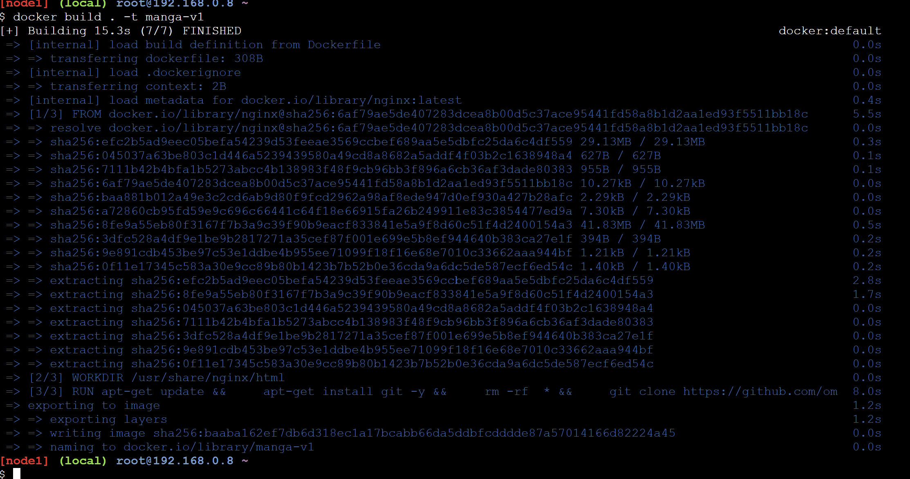

# Manga Characters Static Website

Welcome to the Epic Characters Static Website! This project showcases a static website featuring characters from various popular series. Each character has a dedicated section with information and media.

## Characters Featured

- **Naruto Uzumaki** (*Naruto*)
- **Monkey D. Luffy** (*One Piece*)
- **Eren Jaeger** (*Attack on Titan*)
- **Ryomen Sukuna** (*Jujutsu Kaisen*)
- **Thorfinn Karlsefni** (*Vinland Saga*)
- **Jin-woo Sung** (*Solo Leveling*)
- **Jinx** (*Arcane*)
- **Loid Forger**, **Yor Forger**, and **Anya Forger** (*Spy x Family*)

## Project Structure

- `index.html` - The main landing page for the website.
- `styles/` - Contains CSS files for styling.
- `scripts/` - Contains JavaScript files for interactivity.
- `images/` - Contains images related to the characters.

## Dockerfile

```Dockerfile
FROM nginx

WORKDIR /usr/share/nginx/html

RUN apt-get update && \
    apt-get install git -y && \
    rm -rf  * && \
    git clone https://github.com/omkar-shelke25/Manga-Characters-static-web-deploy-by-docker-file.git .

EXPOSE 8080

CMD ["nginx", "-g", "daemon off;"]
```

### Dockerfile Explanation

1. **Base Image**:
   ```Dockerfile
   FROM nginx
   ```
   - **Description**: This specifies that the base image for your Docker container is the official Nginx image. Nginx will be used to serve your static content.

2. **Working Directory**:
   ```Dockerfile
   WORKDIR /usr/share/nginx/html
   ```
   - **Description**: Sets the working directory inside the container where subsequent commands will be executed. For Nginx, `/usr/share/nginx/html` is the default directory where it serves static files from.

3. **Install Git and Clone Repository**:
   ```Dockerfile
   RUN apt-get update && \
       apt-get install git -y && \
       rm -rf  * && \
       git clone https://github.com/omkar-shelke25/Manga-Characters-static-web-deploy-by-docker-file.git .
   ```
   - **Description**:
     - `apt-get update`: Updates the package lists for the latest version of packages and their dependencies.
     - `apt-get install git -y`: Installs Git inside the container.
     - `rm -rf *`: Removes all existing files in the working directory. This step ensures that the directory is clean before cloning the repository.
     - `git clone <repository-url> .`: Clones the Git repository into the working directory. The `.` denotes the current directory (`/usr/share/nginx/html`).

4. **Expose Port**:
   ```Dockerfile
   EXPOSE 8080
   ```
   - **Description**: Informs Docker that the container will listen on port 8080 at runtime. This is the port that Nginx will use to serve content.

5. **Command to Run Nginx**:
   ```Dockerfile
   CMD ["nginx", "-g", "daemon off;"]
   ```
   - **Description**: The `CMD` instruction specifies the command to run when the container starts. `nginx -g 'daemon off;'` starts Nginx in the foreground so that the container keeps running.

### Docker Commands

1. **Build the Docker Image**:
   ```bash
   docker build . -t manga-v1
   ```
   - **Description**: Builds the Docker image from the Dockerfile in the current directory (`.`) and tags it as `manga-v1`.

2. **Run the Docker Container**:
   ```bash
   docker run -dit --name server1 -p 8080:8080 -P manga-v1
   ```
   - **Description**:
     - `-d`: Runs the container in detached mode (in the background).
     - `-i`: Keeps STDIN open even if not attached.
     - `-t`: Allocates a pseudo-TTY (terminal).
     - `--name server1`: Names the container `server1`.
     - `-p 8080:8080`: Maps port 8080 of the host to port 8080 of the container.
     - `-P`: Publishes all exposed ports to random ports on the host.
     - `manga-v1`: Specifies the image to use for creating the container.
       


This setup effectively uses Nginx to serve static content from a Git repository, with Docker managing the containerization and deployment.


